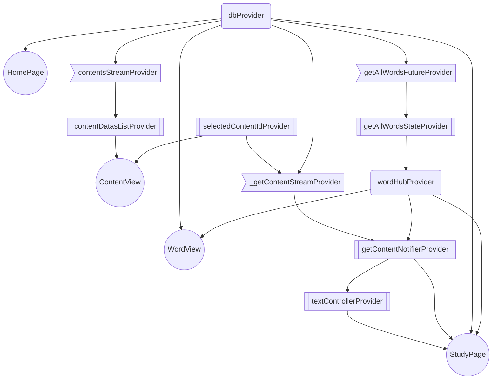

  

```mermaid
graph TD;


10(dbProvider) --> 3((HomePage)) ;

9(wordHubProvider) --> 4((StudyPage)) ;
10(dbProvider) --> 4((StudyPage)) ;
13[[getContentNotifierProvider]] --> 4((StudyPage)) ;
14[[textControllerProvider]] --> 4((StudyPage)) ;


9(wordHubProvider) --> 7((WordView)) ;
10(dbProvider) --> 7((WordView)) ;

11[[selectedContentIdProvider]] --> 8((ContentView)) ;
16[[contentDatasListProvider]] --> 8((ContentView)) ;

18[[getAllWordsStateProvider]] --> 9(wordHubProvider) ;


10(dbProvider) --> 12>_getContentStreamProvider] ;
11[[selectedContentIdProvider]] --> 12>_getContentStreamProvider] ;

9(wordHubProvider) --> 13[[getContentNotifierProvider]] ;
12>_getContentStreamProvider] --> 13[[getContentNotifierProvider]] ;

13[[getContentNotifierProvider]] --> 14[[textControllerProvider]] ;

10(dbProvider) --> 15>contentsStreamProvider] ;

15>contentsStreamProvider] --> 16[[contentDatasListProvider]] ;

10(dbProvider) --> 17>getAllWordsFutureProvider] ;

17>getAllWordsFutureProvider] --> 18[[getAllWordsStateProvider]] ;


```

  