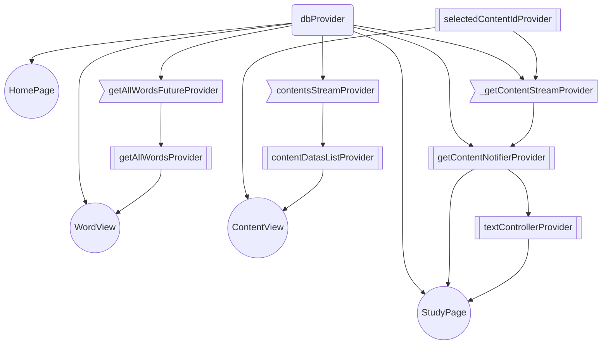

  

```mermaid
graph TD;


9(dbProvider) --> 2((HomePage)) ;


9(dbProvider) --> 5((StudyPage)) ;
12[[getContentNotifierProvider]] --> 5((StudyPage)) ;
13[[textControllerProvider]] --> 5((StudyPage)) ;


9(dbProvider) --> 7((WordView)) ;
18[[getAllWordsProvider]] --> 7((WordView)) ;

10[[selectedContentIdProvider]] --> 8((ContentView)) ;
15[[contentDatasListProvider]] --> 8((ContentView)) ;


9(dbProvider) --> 11>_getContentStreamProvider] ;
10[[selectedContentIdProvider]] --> 11>_getContentStreamProvider] ;

9(dbProvider) --> 12[[getContentNotifierProvider]] ;
11>_getContentStreamProvider] --> 12[[getContentNotifierProvider]] ;

12[[getContentNotifierProvider]] --> 13[[textControllerProvider]] ;

9(dbProvider) --> 14>contentsStreamProvider] ;

14>contentsStreamProvider] --> 15[[contentDatasListProvider]] ;


9(dbProvider) --> 17>getAllWordsFutureProvider] ;

17>getAllWordsFutureProvider] --> 18[[getAllWordsProvider]] ;


```

  