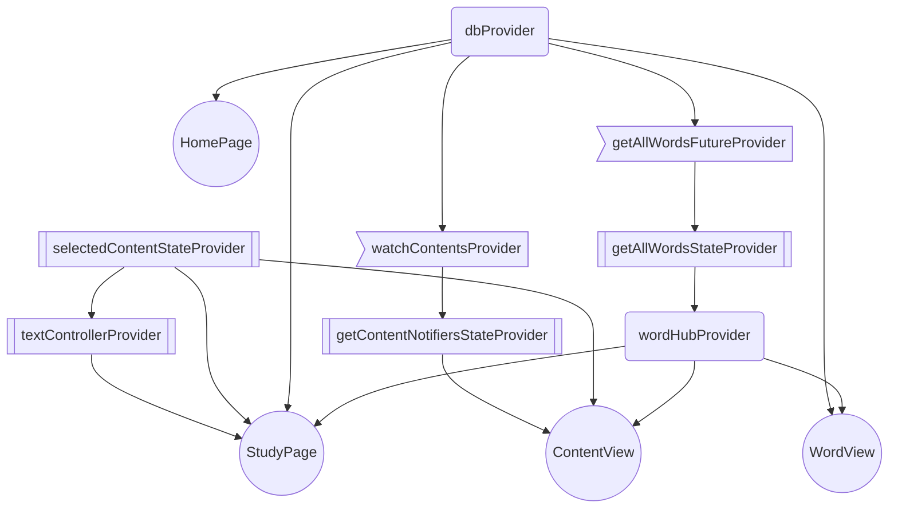

  

```mermaid
graph TD;


10(dbProvider) --> 2((HomePage)) ;


9(wordHubProvider) --> 4((StudyPage)) ;
10(dbProvider) --> 4((StudyPage)) ;
11[[selectedContentStateProvider]] --> 4((StudyPage)) ;
12[[textControllerProvider]] --> 4((StudyPage)) ;


9(wordHubProvider) --> 7((WordView)) ;
10(dbProvider) --> 7((WordView)) ;

9(wordHubProvider) --> 8((ContentView)) ;
11[[selectedContentStateProvider]] --> 8((ContentView)) ;
14[[getContentNotifiersStateProvider]] --> 8((ContentView)) ;

16[[getAllWordsStateProvider]] --> 9(wordHubProvider) ;


11[[selectedContentStateProvider]] --> 12[[textControllerProvider]] ;

10(dbProvider) --> 13>watchContentsProvider] ;

13>watchContentsProvider] --> 14[[getContentNotifiersStateProvider]] ;

10(dbProvider) --> 15>getAllWordsFutureProvider] ;

15>getAllWordsFutureProvider] --> 16[[getAllWordsStateProvider]] ;


```

  