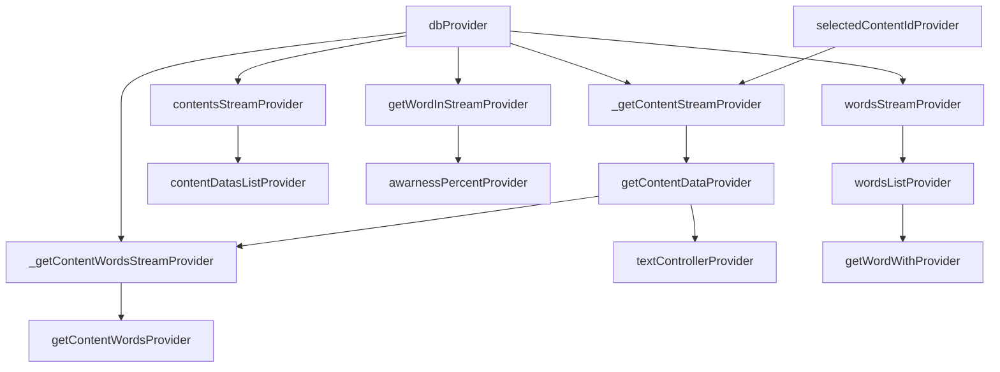

  

```mermaid
graph TD;


dbProvider --> _getContentStreamProvider ;
selectedContentIdProvider --> _getContentStreamProvider ;

_getContentStreamProvider --> getContentDataProvider ;

dbProvider --> _getContentWordsStreamProvider ;
getContentDataProvider --> _getContentWordsStreamProvider ;

_getContentWordsStreamProvider --> getContentWordsProvider ;

getContentDataProvider --> textControllerProvider ;

dbProvider --> contentsStreamProvider ;

contentsStreamProvider --> contentDatasListProvider ;

dbProvider --> getWordInStreamProvider ;

getWordInStreamProvider --> awarnessPercentProvider ;


dbProvider --> wordsStreamProvider ;

wordsStreamProvider --> wordsListProvider ;

wordsListProvider --> getWordWithProvider ;


```

  