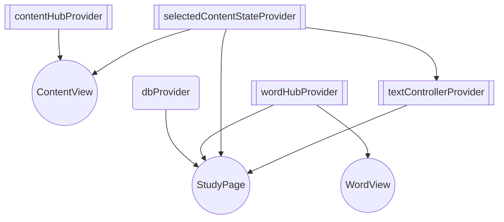

  

```mermaid
graph TD;


9(dbProvider) --> 4((StudyPage)) ;
10[[wordHubProvider]] --> 4((StudyPage)) ;
12[[selectedContentStateProvider]] --> 4((StudyPage)) ;
13[[textControllerProvider]] --> 4((StudyPage)) ;


10[[wordHubProvider]] --> 7((WordView)) ;

11[[contentHubProvider]] --> 8((ContentView)) ;
12[[selectedContentStateProvider]] --> 8((ContentView)) ;


12[[selectedContentStateProvider]] --> 13[[textControllerProvider]] ;


```

  