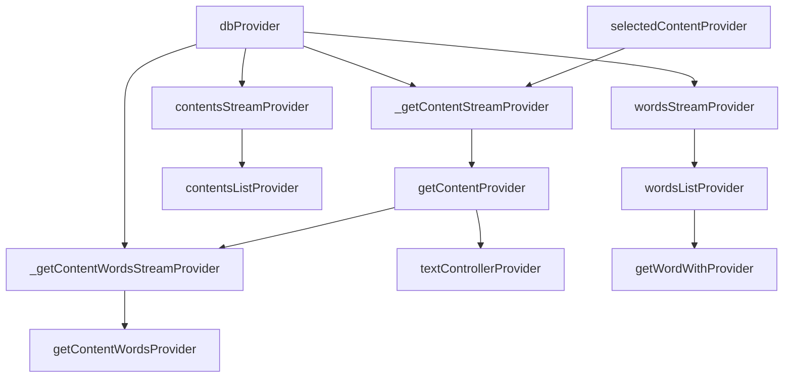

  

```mermaid
graph TD;


dbProvider --> _getContentStreamProvider ;
selectedContentProvider --> _getContentStreamProvider ;

_getContentStreamProvider --> getContentProvider ;

dbProvider --> _getContentWordsStreamProvider ;
getContentProvider --> _getContentWordsStreamProvider ;

_getContentWordsStreamProvider --> getContentWordsProvider ;

getContentProvider --> textControllerProvider ;

dbProvider --> contentsStreamProvider ;

contentsStreamProvider --> contentsListProvider ;


dbProvider --> wordsStreamProvider ;

wordsStreamProvider --> wordsListProvider ;

wordsListProvider --> getWordWithProvider ;


```

  