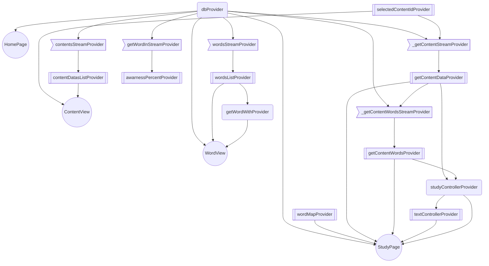

  

```mermaid
graph TD;


9(dbProvider) --> 3((HomePage)) ;

9(dbProvider) --> 4((StudyPage)) ;
10[[wordMapProvider]] --> 4((StudyPage)) ;
13[[getContentDataProvider]] --> 4((StudyPage)) ;
15[[getContentWordsProvider]] --> 4((StudyPage)) ;
16[[textControllerProvider]] --> 4((StudyPage)) ;
17(studyControllerProvider) --> 4((StudyPage)) ;


9(dbProvider) --> 7((WordView)) ;
24[[wordsListProvider]] --> 7((WordView)) ;
25(getWordWithProvider) --> 7((WordView)) ;

11[[selectedContentIdProvider]] --> 8((ContentView)) ;
19[[contentDatasListProvider]] --> 8((ContentView)) ;


9(dbProvider) --> 12>_getContentStreamProvider] ;
11[[selectedContentIdProvider]] --> 12>_getContentStreamProvider] ;

12>_getContentStreamProvider] --> 13[[getContentDataProvider]] ;

9(dbProvider) --> 14>_getContentWordsStreamProvider] ;
13[[getContentDataProvider]] --> 14>_getContentWordsStreamProvider] ;

14>_getContentWordsStreamProvider] --> 15[[getContentWordsProvider]] ;

17(studyControllerProvider) --> 16[[textControllerProvider]] ;

13[[getContentDataProvider]] --> 17(studyControllerProvider) ;
15[[getContentWordsProvider]] --> 17(studyControllerProvider) ;

9(dbProvider) --> 18>contentsStreamProvider] ;

18>contentsStreamProvider] --> 19[[contentDatasListProvider]] ;

9(dbProvider) --> 20>getWordInStreamProvider] ;

20>getWordInStreamProvider] --> 21[[awarnessPercentProvider]] ;


9(dbProvider) --> 23>wordsStreamProvider] ;

23>wordsStreamProvider] --> 24[[wordsListProvider]] ;

24[[wordsListProvider]] --> 25(getWordWithProvider) ;


```

  