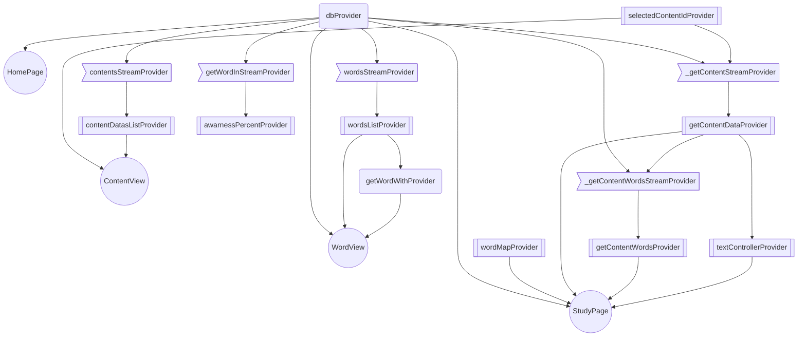

  

```mermaid
graph TD;


9(dbProvider) --> 3((HomePage)) ;

9(dbProvider) --> 4((StudyPage)) ;
10[[wordMapProvider]] --> 4((StudyPage)) ;
13[[getContentDataProvider]] --> 4((StudyPage)) ;
15[[getContentWordsProvider]] --> 4((StudyPage)) ;
16[[textControllerProvider]] --> 4((StudyPage)) ;


9(dbProvider) --> 7((WordView)) ;
23[[wordsListProvider]] --> 7((WordView)) ;
24(getWordWithProvider) --> 7((WordView)) ;

11[[selectedContentIdProvider]] --> 8((ContentView)) ;
18[[contentDatasListProvider]] --> 8((ContentView)) ;


9(dbProvider) --> 12>_getContentStreamProvider] ;
11[[selectedContentIdProvider]] --> 12>_getContentStreamProvider] ;

12>_getContentStreamProvider] --> 13[[getContentDataProvider]] ;

9(dbProvider) --> 14>_getContentWordsStreamProvider] ;
13[[getContentDataProvider]] --> 14>_getContentWordsStreamProvider] ;

14>_getContentWordsStreamProvider] --> 15[[getContentWordsProvider]] ;

13[[getContentDataProvider]] --> 16[[textControllerProvider]] ;

9(dbProvider) --> 17>contentsStreamProvider] ;

17>contentsStreamProvider] --> 18[[contentDatasListProvider]] ;

9(dbProvider) --> 19>getWordInStreamProvider] ;

19>getWordInStreamProvider] --> 20[[awarnessPercentProvider]] ;


9(dbProvider) --> 22>wordsStreamProvider] ;

22>wordsStreamProvider] --> 23[[wordsListProvider]] ;

23[[wordsListProvider]] --> 24(getWordWithProvider) ;


```

  